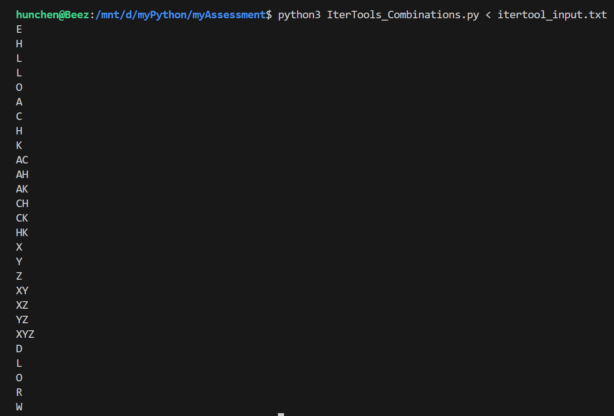

## Itertools & Combinations

`https://www.hackerrank.com/challenges/itertools-combinations/problem` <br>

This tool returns the `r` length subsequences of elements from the input iterable. <br>

Combinations are emitted in lexicographic sorted order. So, if the input iterable is sorted, the combination tuples will be produced in sorted order. <br>

## Sample Code

```
>>> from itertools import combinations
>>> 
>>> print list(combinations('12345',2))
[('1', '2'), ('1', '3'), ('1', '4'), ('1', '5'), ('2', '3'), ('2', '4'), ('2', '5'), ('3', '4'), ('3', '5'), ('4', '5')]
>>> 
>>> A = [1,1,3,3,3]
>>> print list(combinations(A,4))
[(1, 1, 3, 3), (1, 1, 3, 3), (1, 1, 3, 3), (1, 3, 3, 3), (1, 3, 3, 3)]
```

## Task

- You are given a string `S`. <br>
- Your task is to print all possible combinations, up to size `k`, of the string in lexicographic sorted order. <br>

## Input Format

A single line containing the string `S` and integer value `k` separated by a space. <br>

## Constraints

`0 < k ≤ len(S)` <br>
The String contains only UPPERCASE characters. <br>

## Output Format

Print the different combinations of string `S` on separate lines. <br>


## Sample Input

```
HACK 2
```

## Sample Output

```
A
C
H
K
AC
AH
AK
CH
CK
HK
```

## Test Results

To test this script, there is a test file named: `itertool_input.txt` in the same directory. <br>
Run this script with the following command: <br>

`python3 IterTools_Combinations.py < itertool_input.txt` <br>

 <br>

Okay, I think I get it. <br>

... Thoughts...

The `itertool` could take any string `(S or s)` `"NEW YORK 2"` or `"new york 1"` and print all the combinations up to the `size` `2` or `1` designated in the test file `inertool_input.txt`. <br>
Within this for loop the `2` or `1` is indicated by the size of `k`:

```
for i in range(1, k + 1): # Generate combinations of size 1 to k 
        for comb in combinations(S, i): 
            results.append(''.join(comb))... 
```
## Flexibility

`Itertools` allows it to handle any input size string, uppercase, lowercase, or even containing spaces... <br>
By iterating over the combinations of sizes `1` to `k`, the code geneates all possible `lexicographic` combinations up to the desired `size`... <br>

## Conculsion

After completing this Hacker Rank challenge, I understood what it did, But I wasn't understanding how it could be used. <br>

I asked my AI friend and it provided me with a interesting list of uses cases. <br>
Here are a few: <br> 

- Data Science and Analytics
- Cryptography
- Biology and Chemistry
- Game Design and Theory
- Text and Language Applications
- Machine Learning and AI

I though-up a few applications utilizing `itertools`, I think would be exciting project to actully create... <br> 


## Noted Sources

- https://docs.python.org/2/library/itertools.html#itertools.combinations
- https://docs.python.org/3/library/itertools.html 
