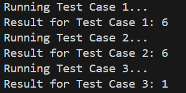

## Maximum Subarray Sum

`https://www.hackerrank.com/challenges/maximum-subarray-sum/problem` <br>

## Problem

We define the following: <br>

A subarray of array `a` of length `n` is a contiguous segment from `a[i]` through `a[j]` where `0 ≤ i ≤ j < n`. <br>
The sum of an array is the sum of its elements.  <br>
Given an `n` element array of integers, `a`, and an integer, `m`, determine the maximum value of the sum of any of its subarrays modulo `m`.  <br>

Example  <br>


```
a = [1,2,3]
m = 2
```

The following table lists all subarrays and their moduli:  <br>
```
	        sum    %2
[1]		1	1
[2]		2	0
[3]		3	1
[1,2]	        3	1
[2,3]	        5	1
[1,2,3]	        6	0
```
<br>

The maximum modulus is 1. <br>

### Function Description

Complete the maximumSum function. <br>

maximumSum has the following parameter(s): <br>

- long `a[n]`: the array to analyze <br>
- long `m`: the modulo divisor <br>

### Returns
- long: the maximum (subarray sum modulo `m`) <br>

### Input Format

The first line contains an integer `q`, the number of queries to perform. <br>

The next `q` pairs of lines are as follows: <br>

- The first line contains two space-separated integers `n` and (long)`m`, the length of `a` and the modulo divisor. <br>
- The second line contains `n` space-separated long integers `a[i]`. <br>

### Constraints

- `2 ≤ n ≤ 10^5`
- `1 ≤ m ≤ 10^14`
- `1 ≤ a[i] ≤ 10^18`
- `2 ≤ the sum of n over all test cases ≤ 5 * 10^5`

### Sample Input

```
STDIN       Function
-----       --------
1           q = 1
5 7         a[] size n = 5, m = 7
3 3 9 9 5
```

### Sample Output

```
6
```

### Explanation

The subarrays of array `a = [3,3,9,9,5]` and their respective sums modulo `m = 7` are ranked in order of length and sum in the following list: <br>

`implies = ⇒` <br>
`variable approach = →`

```
1. [9] ⇒ 9 %7 = 2 and [9] → 9 %7 = 2
   [3] ⇒ 3 %7 = 3 and [3] → 3 %7 = 3
   [5] ⇒ 5 %7 5
```

<br>

```
2. [9,5] ⇒ 14 %7 = 0
   [9,9] ⇒ 18 %7 = 4
   [3,9] ⇒ 12 %7 = 5
   [3,3] ⇒ 6 %7 = 6
```

<br>

```
3. [3,9,9] ⇒ 21 %7 = 0
   [3,3,9] ⇒ 15 %7 = 1
   [9,9,5] ⇒ 23 %7 = 2
```

<br>

```
4. [3,3,9,9] ⇒ 24 %7 =3
   [3,9,9,5] ⇒ 26 %7 = 5
```

<br>

```
5. [3,3,9,9,5] ⇒ 29 %7 = 1
```

<br>

The maximum value for `subarray sum %7` for any subarray is `6`. <br>

## ...Thoughts...

### Brute-Forcing ALL the subarrays

There is this approach... <br> 

- 1. `Iterate` through the `Array`... <br>
Compute the cumulative sums `modulo m` as I iterate through... <br>

- 2. Maintain a sorted list of prefix sums `modulo m`. <br>
Using `Binary Search` for the current cumulative sum `modulo m`, find the smallest prefix sum larger than it. <br>

### `Cumulative Sums`

Could use, or will use!/? `Cumulative Sums`... <br>
Use `Cumulative Sums` to sum-up the `subarray sums`... <br>

The sum of a subarray `a[i : j]` is: <br>
`the subarray sum = cumulative sum[j] - cumulative sum[i - 1]` <br>

...next... <br>

If `two cumulative sums` have the same `modulo m`, subtracting them forms a subarray sum divisible by `m`. <br>

...now if... <br>

Have to find `two cumulative sums` with the smallest difference greater than `0` when taken `modulo m`. 

## Possible Solution

1. Initialization: <br>

- 1. Start with the Variable: `current_sum` = `0`, `max_mod_sum` = `0`, and a list of `prefix_sums`. <br>

```
max_mod_sum = 0
current_sum = 0
prefix_sums = []
```

2. Iterate Through the Array: <br>

- 2. Compute the cumulative sum `modulo m` for each element. <br>

```
current_sum = (current_sum + value) % m
```

- 3. Update `max_mod_sum` to store the `maximum` value received. <br>

```
max_mod_sum = max(max_mod_sum, current_sum)
```

3. Binary Search for Wrap-Around:

- 4. Use the `bisect` library to find the smallest prefix sum `larger` than the `current_sum`. <br>

```
idx = bisect.bisect_right(prefix_sums, current_sum)
if idx < len(prefix_sums):
```

- 5. Compute the modulo difference between `current_sum` and the found `prefix sum` to handle the `wrap-around` cases. <br>

```
max_mod_sum = max(max_mod_sum, (current_sum - prefix_sums[idx] + m) %m)
```

4. Update Prefix Sums:

- 6. `Insert` the `current_sum` into the sorted list of `prefix_sums` to maintain the order. <br>

```
bisect.insort(prefix_sums, current_sum)
```

## Test Case image

