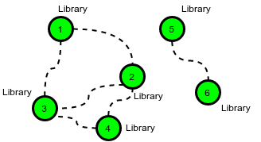

## Roads and Libraries

https://www.hackerrank.com/challenges/one-month-preparation-kit-torque-and-development/problem

I like this one! <br>

Determine the minimum cost to provide library access to all citizens of HackerLand. There are `n` cities numbered from `1` to `n`. Currently there are no libraries and the cities are not connected. Bidirectional roads may be built between any city pair listed in `cities`. A citizen has access to a library if: <br>

- Their city contains a library. <br>
- They can travel by road from their city to a city containing a library. <br>


## Example

The following figure is a sample map of HackerLand where the dotted lines denote possible roads: <br>

 

<br>
`c_road = 2` <br>
`c_lib = 3` <br>
`cities = [[1,7], [1,3], [1,2], [2,3], [5,6], [6,8]]` <br>

- The cost of building any road is `cc_road = 2`, and the cost to build a library in any city is `c_lib = 3`. Build `5` roads at a cost of `5 x 2 = 10` and `2` libraries for a cost of `6`. One of the available roads in the cycle `1 → 2 → 3 → 1` is not necessary.<br>

- There are `q` queries, where each query consists of a map of HackerLand and value of `c_lib` and `c_road`. For each query, find the minimum cost to make libraries accessible to all the citizens. <br>

## Function Description

Complete the function for `roadsAndLibraries` <br>
`roadsAndLibraries` has the following parameters: <br>

- int n: integer, the number of cities <br>
- int c_lib: integer, the cost to build a library <br>
- int c_road: integer, the cost to repair a road <br>
- int cities[m][2]: each  contains two integers that represent cities that can be connected by a new road <br>

## Returns

- int: the minimal cost

## Input Format

The first line contains a single integer `q`, that denotes the number of queries. <br>

The subsequent lines describe each query in the following format: <br>

- The first line contains four space-separated integers that describe the respective values of `n`, `m`, `c_lib` and `c_road`, the number of cities, number of roads, cost of a library and cost of a road. <br>
- Each of the next `m` lines contains two space-separated integers, u[i] and v[i], that describe a bidirectional road that can be built to connect cities u[i] and v[i]. <br>

## Constraints

- `1 ≤ q ≤ 10`
- `1 ≤ n ≤ 10^5`
- `0 ≤ m ≤ min(10^5, n*(n-1)/2)`
- `1 ≤ c_road, c_lib ≤ 10^5`
- `1 ≤ u[i], v[i] ≤ n`
- Each road connects two distinct cities. <br>

## Sample Input

```
STDIN       Function
-----       --------
2           q = 2
3 3 2 1     n = 3, cities[] size m = 3, c_lib = 2, c_road = 1
1 2         cities = [[1, 2], [3, 1], [2, 3]]
3 1
2 3
6 6 2 5     n = 6, cities[] size m = 6, c_lib = 2, c_road = 5
1 3         cities = [[1, 3], [3, 4],...]
3 4
2 4
1 2
2 3
5 6
```

## Sample Output
```
4
12
```

## Explanation

Perform the following `q = 2` queries: <br>

1. Hackerland contains `n = 3` cities and can be connected by `m = 3` bidirectional roads. The price of building a library is `C_lib = 2` and the price for repairing a road is `C_road = 1`.


<br>

The cheapest way to make libraries accessible to all is to: <br>

Build a library in city `1` at a cost of `x = 2`. <br>
Build the road between cities `1` and `2` at a cost of `y = 1`. <br>
Build the road between cities `2` and `3` at a cost of `y = 1`. <br>
This gives a total cost of `2 + 1 + 1 = 4`. Note that the road between cities `3` and `1` does not need to be built because each is connected to city `2`. <br>

2. In this scenario it is optimal to build a library in each city because the cost to build a library is less than the cost to build a road. <br>



<br>

There are `6` cities, so the total cost is `6 * 2 = 12`.


```
#
# Complete the 'roadsAndLibraries' function below.
#
# The function is expected to return a LONG_INTEGER.
# The function accepts following parameters:
#  1. INTEGER n
#  2. INTEGER c_lib
#  3. INTEGER c_road
#  4. 2D_INTEGER_ARRAY cities
#
```

## Minimize Costs

The goal is to minimize the cost of providing library access to all cities in HackerLand... two choices... <br>

1. We could: <br>

- `Build` a `library (c_lib)` in city. <br>
- `Build` `roads (c_road)` to connect cities so that they share a `library (c_lib)`. <br>

2. Or we could: <br>

- If it the cost of `building` a `library (c_lib)` is less than or equal to (`≤`) the cost of building a `road (c_road)`, it's cheaper to build `libraries (c_lib)` in every city. <br>
- `Else`, find connected components of cities using `roads (c_road)` and minimize the cost by connecting cities within components. <br>  

## Depth-First Search (DFS) vs Breadth-First Search (BFS) ... algorithm design

- 1. Imagine all the cities with a graph overlay...<br>
- Each of the cities is represented as a `node`. <br>
- Each road would be considered an `edge`. <br>

- 2. Using graph traversal algorithms: `DFS` or `BFS` to find connected components.<br> 

- 3. For each connected component <br>
- Build one `library (c_lib)` in one city.
- Connect the rest of the cities using `roads`.


## Noted Sources

- https://www.geeksforgeeks.org/deque-in-python/
- https://docs.python.org/3/library/collections.html#collections.defaultdict
- https://www.geeksforgeeks.org/deque-in-python/
- https://www.w3schools.com/python/python_sets_access.asp

