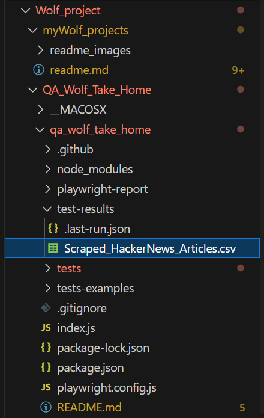

## 12/8/2024: my Wolf project

This readme are the steps taken to complete this `https://www.task-wolf.com/apply-qae` assignment.<br>

- 1. Create a script on [Hacker News](https://news.ycombinator.com/) using JavaScript and Microsoft's [Playwright](https://playwright.dev/) framework. <br>

- 2. Edit the `index.js` file in this project to go to [Hacker News/newest](https://news.ycombinator.com/newest) and validate that EXACTLY the first 100 articles are sorted from newest to oldest. You can run your script with the `node index.js` command. <br>

### Coding Environment
- Microsoft Studio 2<br>
- VS code w/: PWSH & WSL <br>

 <br>

### Troubleshooting to success `!` vs `?`

My Node.js version is out of date... <br>
The latest version is [v22.12.0 (LTS)](https://nodejs.org/en/download/package-manager) <br>

Installing On `Windows` using `FNM` selection. <br>

```
# installs fnm (Fast Node Manager)
winget install Schniz.fnm

# configure fnm environment
fnm env --use-on-cd | Out-String | Invoke-Expression

# download and install Node.js
fnm use --install-if-missing 22

```

` node -v && npm -v` <br>

```
v22.12.0
10.9.0
```  
<br>

... Next ... <br>

### Install Playwright

`npm init playwright@latest` 

config: <br>

JavaScript <br>
tests <br>
GitHub (yes) <br>
Playwright browser installed <br>

`✔ Success!` <br>

 <br>

### 12/9/24 HTML Test Reports 

- Not sure if this is needed regarding the main assignment... I do like discovering things though... <br>

`npx playwright show-report` <br>

It took a moment... <br>
I received a similar HTML report as on playwright.dev/doc/intro: <br>

 <br>

### Run the Example Test in UI Mode

- From the image on the playwright website instructions... It looks like this next command is going to test the `Networking` speed of the `Playwright` framework application... Well it does mention user interface... <br> 
My thought is the command is going to test the response time from when a user clicks on an object. <br>

`npx playwright test --ui` <br>

 <br>

After searching around the UI interface... I thought back to the Playwright website mentioning End-to-End. <br>

### Quick what is `End-to-End` 

- `End-to-End` or `E2E` is a method of testing, that makes me think of creating `unit-tests` for (in Playwrite's case) web applications from the perspective of the user. You want to test all the possible interactions a user might have. <br>
- `Playwright` automates the browser interactions to test the complete `E2E` workflow of a web-application. <br>
- Using `Playwright` allows a Quality Assurance `(QA)` software engineer to create test documentation for a web application, documenting that the features are functional or need attention. <br>

Interesting... <br>

## Playwright Tests

`npx playwright test` <br>

- Before I start the assignment I wanted to make sure I can run the simple test from `https://playwright.dev/docs/writing-tests`.<br>
I typed out the `First Test` .js script in the `tests` folder.<br>

Attempt to resolve the `FirstTest.js` from not executing. <br>

- I checked that `npm` `playwright/test` package was correctly installed. <br>
- I updated the `package.json` file to include: <br>

```
"type": "module",
  "scripts": {
    "test": "playwright test"
  },
```
<br>

- I figured out what the issue was... Within the `Playwright` framework, The `Test` files need to have `.spec.js` for `npx playwright` to recognize the test file.

 

## Now to The Assignment

- 1. Using the `Playwright` Javascript framework create a script on [Hacker News](https://news.ycombinator.com/). <br>

- 2. Edit the `index.js` file to validate that `EXACTLY` the first 100 articles are sorted from newest to oldest. <br>

Thoughts... <br>
On the Hacker News website, the submissions appear to be from newest to oldest 1,2,3...100...but. <br>
The `new` posts do not appear to be in the order of when they were posted. <br> 
From further inspection, the `new` `1.` post states it was posted 2 hours ago, so the sequential post times should be two plus hours after this current 2-hour post (Example: 3 hours, 4 hours, 5 hours, etc...). However, that is not the case, the times of the sequential posts are not in an order of succession. Hence, the `assignment` is to validate that first 100 articles are sorted from newest to oldest. <br> 

### Scrape for Timestamps and Compare the order

- First: I want to sort the webpage to the newest articles. <br>
- Second: Scrape the timestamps from each article. <br>
- Third: Compare the article's timestamps. <br>
- Fourth: I want to check, and validate that they are in descending order. <br>

### `tests` folder issues

- I had an issue with having multiple unit tests within the `tests` directory and not being able to execute an individual unit-test. <br>
The reason was the command: `npx playwright test` executes all the executable files that have the `// @ts-check` and `.spec.js` within the tests folder. <br>
- I changed the command only to run one selected unit-test. <br>
`npx playwright test FirstTest.js` <br>

In my `pwsh` terminal: <br>
`2 passed (9.9s)` <br>

## Unit-Test: `TimeStampComparing.spec.js`

I created my unit-test, named: `TimeStampComparing.spec.js`. The unit test is to go to the webpage, wait for it to load, to then select the `newest` option. <br>
The unit-test then scrapes the `Titles` and `Timestamps` to validate the order is indeed correctly sorted by `newest`.

### Unit-Test: `TimeStampComparing.spec.js` Troubleshooting #1

Error Message: <br>
```
ReferenceError: require is not defined in ES module scope, you can use import instead
This file is being treated as an ES module because it has a '.js' file extension and 'D:\myPython\Wolf_project\QA_Wolf_Take_Home\qa_wolf_take_home\package.json' contains "type": "module". To treat it as a CommonJS script, rename it to use the '.cjs' file extension.

   at TimeStampComparing.spec.js:4

  2 |
  3 | // Using Chrome
> 4 | const { chromium } = require("playwright");
    |                      ^
  5 | const fs = require("fs");
  6 | const path = require("path");
  7 |
    at D:\myPython\Wolf_project\QA_Wolf_Take_Home\qa_wolf_take_home\tests\TimeStampComparing.spec.js:4:22
Error: No tests found.
Make sure that arguments are regular expressions matching test files.
You may need to escape symbols like "$" or "*" and quote the arguments.
```

- So, it says I should use `import` instead, and rename the file with another / or different file extension... Also, I am using a common javascript syntax. <br>
- The `playwright` `tests` folder files use a different syntax... <br>

After further research, I have to ensure I am following the `Playwrights` test framework. <br>

### Unit-Test: `TimeStampCompare.spec.js` Troubleshooting #2

`npx playwright test TimeStampCompare.spec.js` <br>

Error Message # 2: <br>

```
Running 1 test using 1 worker

  ✘  1 TimeStampCompare.spec.js:9:1 › Scrape and validate Hacker News newest order option (4.8s)
Found 30 articles.
Scraped data written to D:\myPython\Wolf_project\QA_Wolf_Take_Home\qa_wolf_take_home\tests\test-results\Scraped_HackerNews_Articles.csv
The first 100 articles are NOT sorted by Newest.


  1) TimeStampCompare.spec.js:9:1 › Scrape and validate Hacker News newest order option ────────────

    Error: expect(received).toBeTruthy()

    Received: false

      51 |
      52 |     // Validate
    > 53 |     await expect(isSorted).toBeTruthy();
         |                            ^
      54 |
      55 | })
        at D:\myPython\Wolf_project\QA_Wolf_Take_Home\qa_wolf_take_home\tests\TimeStampCompare.spec.js:53:28

  1 failed
    TimeStampCompare.spec.js:9:1 › Scrape and validate Hacker News newest order option ─────────────
```

- Interesting the terminal message isn't necessarily an "error" message. <br>
The message states that line `#53` failed because `isSorted` returned `false`... `isSorted` is intended to validate the `newest` option is indeed sorted the articles by `newest` first. <br>

... Thoughts... <br>

So, from `inspecting` the `news.ycombination.com/newest` webpage... The `<span class="age" title="Year-Month-dayThour:minutes:seconds">` section is in ISO format. <br>
I need to retreive the absolute Timestamp within the `title` attribute of the `<a>` tags of the `.age` class elements. <br>
The `ISO` formatted timestamps can be parsed...<br>

### Update to `Absolute Time` by accessing the DOM

- 1. DOM = Document Object Model: <br>
The `DOM` is how a webpage's HTML is structured. The `tags` within a webpage: `<div>`, `<a>`, `<tr>`, etc are `nodes` with parent and child-sibling relationships. <br>


`SyntaxError: Unexpected identifier` <br>
`SyntaxError: Unexpected token 'const'` <br>
`✘  1` <br>
`1 failed` <br>
`1 failed` <br>
`1 failed` <br>
`1 failed` <br>
`1 failed` <br>
`1 passed ` <br>

## Success!!! 

Using: `TimeStampCompare.spec.js` as the test script I was able to resolve the issues. <br> 

- Once confirming I was indeed at the correct url: `https://news.ycombinator.com/newest`. <br>

- I confirmed that the webpage was indeed loading the articles before selecting the `newest` option. <br>

- I had to change my relative timestamps to absolute timestamps. Because "0 minutes ago", or "2 minutes ago" are being processed as strings. which is causing incorrect comparisons. <br>

 <br>

 <br>

## `Newest` Option NOT Globally set

... Thoughts...<br>
I noticed an issue since being able to run successful unit tests. There is an issue when navigating to the next page when the `More` button is selected. <br>
Hacker News does not dynamically `re-sort` or preserve the `newest` sort order globally. The `newest` option only applies to the current page being viewed, so the sequential articles are not adhering to a `Exact` `Newest-first` order. <br>

- I think I could increase the `maxArticles = 60, 90, 100` in stages for testing. <br>
- While combining all the articles after scraping from the pages (4 pages for 100 articles) into a `single list`. <br>
- Perform the sorting operation on the `single list` based on the ISO timestamps. <br>
- Validate after sorting to check if the articles are globally sorted by the `Newest` timestamp. <br>

## 100 Articles in Exactly `Newest` order Unit-Test Success
Navigating to: 1 <br>
Navigating to: 2 <br>
Navigating to: 3 <br>
Navigating to: 4 <br>
Found 100 articles. <br>
Data written to: D:\Storage_Location\Scraped_HackerNews_Articles_100.csv
The first 100 articles are sorted Exactly by Newest.


## Question One: Index.js 

`Index.js` <br>

`node index.js` <br>

- Removing the unessential debugging console logging statements <br>
- Removing my comments I used in my `TimeStampCompare.spec.js` <br>
- I am cleaning-up the code so it looks "neater or less involved". <br>
- I am re-configuring the `index.js` to use the `TimeStampCompare.spec.js` CSV logging features. <br>
- Adding the `More` button function to the index.js script. <br>

### Assignment tested and verified


## Noted Sources:
- https://nodejs.org/en/download/package-manager 
- https://playwright.dev/docs/writing-tests 
- https://playwright.dev/docs/api/class-page#page-evaluate 
- https://playwright.dev/docs/api/class-genericassertions
- O'Reilly Web Scraping with Python: Data Extraction from the Modern Web, By: Ryan Mitchell
- https://www.w3schools.com/js/js_dates.asp 
